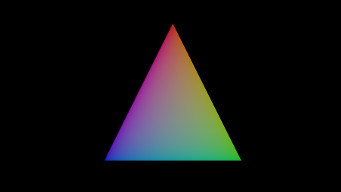
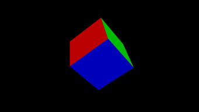
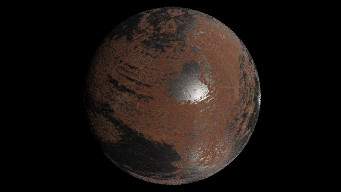
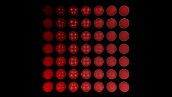
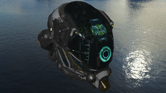

---

# Lugdunum3D

A modern cross-platform 3D rendering engine built with Vulkan and modern C++14. Documentation and more are available [on the homepage](https://lugdunum3d.github.io/).

# Building

Our build system is CMake and this repository contains the appropriate build files to build on Linux, Windows and Android using a C++14 compiler (see [tested toolchains](#tested-toolchains)). Third party dependencies are built using [Lugdunum-ThirdParty](https://github.com/Lugdunum3D/Lugdunum-ThirdParty) and the `thirdpary.yml` file located at the root of this repository. [Follow the instructions on our documentation](https://lugdunum3d.github.io/doc/build.html) to build Lugdunum.

##  Linux
[&maxAge=300)](https://circleci.com/gh/Lugdunum3D/Lugdunum/tree/master) [&maxAge=300)](https://circleci.com/gh/Lugdunum3D/Lugdunum/tree/dev)

##  Windows 
[&maxAge=300)](https://circleci.com/gh/Lugdunum3D/Lugdunum/tree/master) [&maxAge=300)](https://circleci.com/gh/Lugdunum3D/Lugdunum/tree/dev)

# Examples

All the examples can be built using the `CMakeLists.txt` in the `./samples` directory.

## [Triangle](./samples/triangle)

The simplest of all. Renders a colored triangle.
    

## [Cube](./samples/cube)

This basic example draws a procedurally generated rotating cube.
    

## [Sphere PBR](./samples/sphere_pbr)

This example draws a procedurally generated rotating sphere using PBR, which is lit by 4 directional lights.
   

## [Spheres PBR](./samples/spheres_pbr)

This basic examples draws an array of procedurally generated spheres using PBR, the whole array shows a gradient of the PBR parameters.
The spheres are also lit by 4 directional lights, and a free moving camera allows to explore the different materials and reflections.
  

## [Hello](./samples/hello)

Displays the classic [*Battle Damaged Sci-fi Helmet - PBR* by theblueturtle_](https://sketchfab.com/models/b81008d513954189a063ff901f7abfe4) with a skybox and a free moving camera.
    

# Tests

Tests can be enabled using the `BUILD_TESTS` CMake flag.

# Tested toolchains

| Compiler            | Operating System                     | Architecture | Version String |
|---------------------|--------------------------------------|--------------|----------------|
| Clang 3.8           | Android NDK r14b with Unified Header | arm64-v8a    | Android clang version 3.8.275480  (based on LLVM 3.8.275480) |
| Visual Studio 2017  | Windows 10 Build 16170               | x64          | MSVC 19.10.25017.0 |
| GCC 6.2.0           | Linux Ubuntu 16.04.1 with kernel 4.8 | x64          | gcc version 6.2.0 20160901 |
| GCC 6.2.0           | Linux Tegra-Ubuntu 4.4.15            | aarch64      | gcc version 6.2.0 20160901 |
