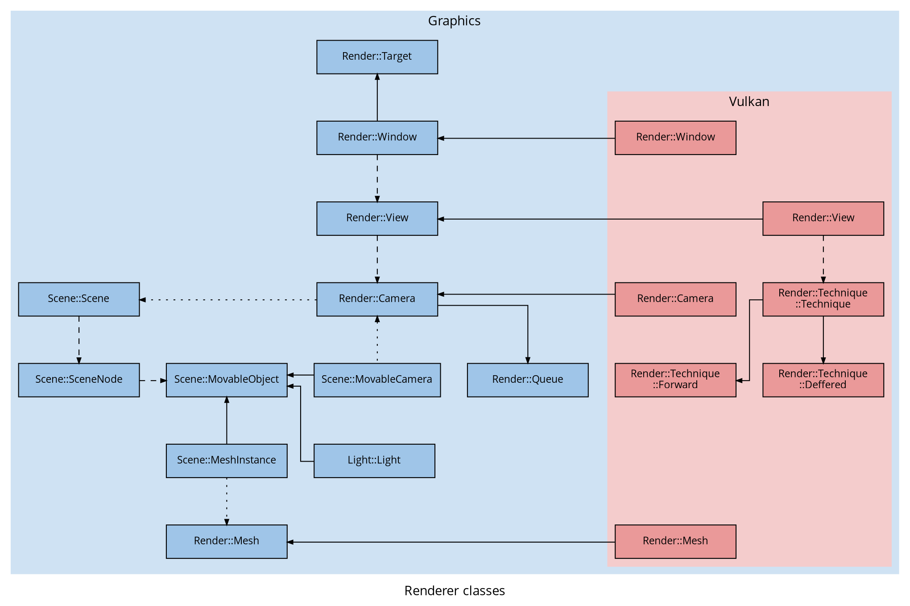

# Architecture of Lugdunum

The purpose of this section is to introduce you  internal operation of our 3D engine. We will first talk about the architecture of the renderer. Then we will discuss about the sequencing of the engine graphic's loop, how each component of the [`Renderer::Target`](#lug::Graphics::Renderer::Target) is interacting with the [`Render::Window`](#lug::Graphics::Render::Window) composed of different [`Renderer::View`](#lug::Graphics::Renderer::View). We will then discuss about the GPU & CPU's side operation. We will explain how each buffer is loaded and used by our engine.

## Renderer architecture


The main object of the renderer is the [`Render::Target`](#lug::Graphics::Render::Target). A [`Render::Target`](#lug::Graphics::Render::Target) is any surface on which we can render, e.g. a window or an offscreen image.

A [`Render::Target`](#lug::Graphics::Render::Target) can have multiple [`Render::View`](#lug::Graphics::Render::View)s, each representing a fraction of the [`Render::Target`](#lug::Graphics::Render::Target), defined by a [`Render::View::Viewport`](#lug::Graphics::Render::View::Viewport) and a [`Render::Scissor`](#lug::Graphics::Render::Scissor) defined as following:
```cpp
class Viewport {
public:
    struct {
        float x;
        float y;
    } offset;

    struct {
        float width;
        float height;
    } extent;

    float minDepth;
    float maxDepth;

    inline float getRatio() const;
};

struct Scissor {
    struct {
        float x;
        float y;
    } offset;

    struct {
        float width;
        float height;
    } extent;
};
```

Each of the components of [`Render::View::Viewport`](#lug::Graphics::Render::View::Viewport) and [`Render::View::Scissor`](#lug::Graphics::Render::View::Scissor) are defined as percentage values (i.e. a float between 0.0 an 1.0), so it has the same appearance on every size of the [`Render::Target`](#lug::Graphics::Render::Target).

A unique [`Render::Camera`](#lug::Graphics::Render::Camera) can be attached to a single [`Render::View`](#lug::Graphics::Render::View), i.e. we cannot have a [`Render::Camera`](#lug::Graphics::Render::Camera) attached to two different [`Render::View`](#lug::Graphics::Render::View)s.

[`Render::Camera`](#lug::Graphics::Render::Camera)s contain a [`Render::Queue`](#lug::Graphics::Render::Queue) and have pointer to a [`Scene::Scene`](#lug::Graphics::Scene::Scene), which is created by the user, and can be attached to multiple cameras.

Every frame, the [`Render::Queue`](#lug::Graphics::Render::Queue) is cleared, then filled by the [`Scene::Scene`](#lug::Graphics::Scene::Scene) with the objects visible by the [`Render::Camera`](#lug::Graphics::Render::Camera)'s frustrum.

The [`Render::Queue`](#lug::Graphics::Render::Queue) is finally sent to [`Vulkan::Render::Technique::Technique::render()`](#lug::Graphics::Vulkan::Render::Technique::Technique::render()).




## Sequence diagrams

The sequence diagrams below show how a frame renders in our 3D engine. The [`Render::Target::render()`](#lug::Graphics::Render::Target::render()) method of [`Render::Target`](#lug::Graphics::Render::Target) has been separated in a different diagram lower to ease readability.


Let us describe this sequence diagram, step by step:

Most importantly, `UserApplication` is the user defined class that inherits from [`lug::Core::Application`](#lug::Core::Application) and defines the methods `onEvent` and `onFrame`. [`lug::Core::Application::run()`](#lug::Core::Application::run()) is called (and must be) by the user like in this example:

```cpp
int main(int argc, char* argv[]) {
    UserApplication app;
    
    if (!app.init(argc, argv)) {
        return EXIT_FAILURE;
    }
    
    if (!app.run()) {
        return EXIT_FAILURE;
    }
    
    return EXIT_SUCCESS;
}
```

The method [`lug::Core::Application::run()`](#lug::Core::Application::run()) is the main loop of the engine which polls the events from the window and renders everything correctly. As expected, we can see that the [`lug::Core::Application`](#lug::Core::Application) is polling all the events from the [`Render::Window`](#lug::Graphics::Render::Window) and sending them to the `UserApplication` through the method `UserApplication::onEvent(const lug::Window::Event& event)`.

[`lug::Core::Application`](#lug::Core::Application) is then calling the method [`Renderer::beginFrame()`](#lug::Graphics::Renderer::beginFrame()) which call itself the method `lug::Graphics::Render:Window::beginFrame()` to notify the `lug::Graphics::Render:Window` that we are starting a new frame.

Now, the user can update the logic of the application in the method `UserApplication::onFrame(const lug::System::Time& elapsedTime)`.

At the end of the frame, the method [`Renderer::endFrame()`](#lug::Graphics::Renderer::endFrame()) is called and will call the method [`Render::Target::render()`](#lug::Graphics::Render::Target::render()) for all [`Render::Target`](#lug::Graphics::Render::Target) to draw and will finish the frame by calling the method [`Render::Window::endFrame()`](#lug::Graphics::Render::Window::endFrame()) to notify the [`Render::Window`](#lug::Graphics::Render::Window) that we are ending this frame.


In the method [`Render::Target::render()`](#lug::Graphics::Render::Target::render()), the [`Render::Target`](#lug::Graphics::Render::Target) is calling the method [`Render::View::render()`](#lug::Graphics::Render::View::render()) for each enabled [`Render::View`](#lug::Graphics::Render::View).

A [`Render::View`](#lug::Graphics::Render::View) to be rendered need to update its [`Render::Camera`](#lug::Graphics::Render::Camera) which will fetch all the elements in its [`Render::Queue`](#lug::Graphics::Render::Queue) from the scene with [`Scene::Scene::fetchVisibleObjects()`](#lug::Graphics::Scene::Scene::fetchVisibleObjects()).

So the [`Render::Queue`](#lug::Graphics::Render::Queue) will contain every elements needed to render the [`Scene::Scene`](#lug::Graphics::Scene::Scene), meshes, models, lights, etc.

Then the [`Render::View`](#lug::Graphics::Render::View) can call the render technique to draw the the elements in the [`Render::Queue`](#lug::Graphics::Render::Queue) (e.g. for Vulkan a class inheriting from [`Vulkan::Render::Technique::Technique`](#lug::Graphics::Vulkan::Render::Technique::Technique)).

## Vulkan Rendering

### Global

#### GPU Side

The managing of the [`Vulkan::Render::Window`](#lug::Graphics::Vulkan::Render::Window) and the [`Vulkan::Render::View`](#lug::Graphics::Vulkan::Render::View)s of Lugdunum is pretty straightforward. For simplicitie's sake we have split this process into five steps.


Each arrow represents a Vulkan semaphore for synchronization purpose.

1. We get an available image from the swapchain
2. We change the layout of this image to `VK_IMAGE_LAYOUT_COLOR_ATTACHMENT_OPTIMAL`
3. We render each [`Vulkan::Render::View`](#lug::Graphics::Vulkan::Render::View) in parrallel
4. We change the layout of this image to `VK_IMAGE_LAYOUT_PRESENT_SRC_KHR`
5. We add the image to the presentation queue of the swapchain.

Steps 2 and 4 are using prebuilt Vulkan command buffers, one for each image in the swapchain.
Step 3 is dependant of the render technique used.

#### CPU Side

It is up to each method to select semaphores, from a pool, to be used between each step.

##### Steps 1 & 2

The method [`Vulkan::Render::Window::beginFrame()`](#lug::Graphics::Vulkan::Render::Window::beginFrame()) is used to accomplish steps 1 and 2. This method chooses one semaphore to be notified when the next image is available and chooses N semaphores to notify each [`Vulkan::Render::View`](#lug::Graphics::Vulkan::Render::View) when the image has changed layout. (N being the number of [`Vulkan::Render::View`](#lug::Graphics::Vulkan::Render::View) in the [`Vulkan::Render::Window`](#lug::Graphics::Vulkan::Render::Window))

##### Step 3

The method [`Vulkan::Render::Window::render()`](#lug::Graphics::Vulkan::Render::Window::render()) is used to accomplish step 3. This method uses the N previous semaphores, one for each call to [`Vulkan::Render::View::render()`](#lug::Graphics::Vulkan::Render::View::render()). Each [`Vulkan::Render::View`](#lug::Graphics::Vulkan::Render::View) has a semaphore which is signaled when the view has finished rendering. We will explain how the render technique works in the next part.

##### Steps 4 & 5

The method [`Vulkan::Render::Window::endFrame()`](#lug::Graphics::Vulkan::Render::Window::endFrame()) is used to accomplish steps 4 and 5. This method retrieves all the semaphores from the [`Vulkan::Render::View`](#lug::Graphics::Vulkan::Render::View) and chooses one semaphore to be notified when the image has changed layout.

### Forward render technique

#### GPU Side


The [`Vulkan::Render::Technique::Forward`](#lug::Graphics::Vulkan::Render::Technique::Forward) has two different [`Vulkan::Render::Queue`](#lug::Graphics::Vulkan::Render::Queue), i.e. one transfer and one graphics.

The transfer [`Render::Queue`](#lug::Graphics::Render::Queue) is responsible for updating the datas of the [`Render::Camera`](#lug::Graphics::Render::Camera) and [`Light::Light`](#lug::Graphics::Light::Light)s, each one contained in an uniform buffer [`Vulkan::API::Buffer`](#lug::Graphics::Vulkan::API::Buffer) sent in separate [`Vulkan::API::CommandBuffer`](#lug::Graphics::Vulkan::API::CommandBuffer)s (i.e. "Command buffer A" and "Command buffer B" in the above schema).
These [`Vulkan::API::CommandBuffer`](#lug::Graphics::Vulkan::API::CommandBuffer)s are then sent to the transfer [`Render::Queue`](#lug::Graphics::Render::Queue).

Here is the structure of the uniform buffers for the camera and the lights:
```cpp
// Camera
layout(set = 0, binding = 0) uniform cameraUniform {
    mat4 view;
    mat4 proj;
};

// Directional light
layout(set = 1, binding = 0) uniform lightUniform {
    vec3 lightAmbient;
    vec3 lightDiffuse;
    vec3 lightSpecular;
    vec3 lightDirection;
};

// Point light
layout(set = 1, binding = 0) uniform lightUniform {
    vec3 lightAmbient;
    float lightConstant;
    vec3 lightDiffuse;
    float lightLinear;
    vec3 lightSpecular;
    float lightQuadric;
    vec3 lightPos;
};

// Spot light
layout(set = 1, binding = 0) uniform lightUniform {
    vec3 lightAmbient;
    vec3 lightDiffuse;
    vec3 lightSpecular;
    float lightAngle;
    vec3 lightPosition;
    float lightOuterAngle;
    vec3 lightDirection;
};
```
Each type of lights have a different pipelines using different fragment shaders (That's why all the light uniforms are using the same binding point in the above code sample).

To pass the transformation matrix of the objects we are using pushconstant :
```cpp
layout (push_constant) uniform blockPushConstants {
    mat4 modelTransform;
} pushConstants;
```

The graphics [`Render::Queue`](#lug::Graphics::Render::Queue) is responsible of all the rendering.

The "Command buffer C" for the drawing depends on the two command buffers of transfer by the means of semaphores at different stages of the pipeline, `VK_PIPELINE_STAGE_VERTEX_INPUT_BIT` for the camera and `VK_PIPELINE_STAGE_FRAGMENT_SHADER_BIT` for the lights.


#### CPU Side

##### Buffer Pool

The allocation of the uniform buffers is managed by a [`Vulkan::Render::BufferPool`](#lug::Graphics::Vulkan::Render::BufferPool), one for the camera and one for the lights.

We do not want to have a lot of allocations, so the pool is just allocating a chunk of memory on the GPU which will contains many [`Vulkan::Render::BufferPool::SubBuffer`](#lug::Graphics::Vulkan::Render::BufferPool::SubBuffer)s.

A [`Vulkan::Render::BufferPool::SubBuffer`](#lug::Graphics::Vulkan::Render::BufferPool::SubBuffer) is just part of a bigger [`Vulkan::API::Buffer`](#lug::Graphics::Vulkan::API::Buffer) that we can allocate / free from the pool and bind with a command buffer without worying about the rest of the [`Vulkan::API::Buffer`](#lug::Graphics::Vulkan::API::Buffer).

##### Triple buffering

Because we are using triple buffering, we need a way to store data for a specific image. For that we have [`Vulkan::Render::Technique::Forward::FrameData`](#lug::Graphics::Vulkan::Render::Technique::Forward::FrameData) that contains all we need to render one specific frame (command buffers, depth buffer, etc).

To avoid re-using a command buffer already in use, we are synchronizing their access with a fence.

To share [`Vulkan::Render::BufferPool::SubBuffer`](#lug::Graphics::Vulkan::Render::BufferPool::SubBuffer) across frames, e.g. if the camera does not move, we have a way to reuse the same [`Vulkan::Render::BufferPool::SubBuffer`](#lug::Graphics::Vulkan::Render::BufferPool::SubBuffer). We associate the [`Vulkan::Render::BufferPool::SubBuffer`](#lug::Graphics::Vulkan::Render::BufferPool::SubBuffer) with the object (camera or light), and test at the beginning of the frame if we can use a previous one (if the object has not changed from the update of this [`Vulkan::Render::BufferPool::SubBuffer`](#lug::Graphics::Vulkan::Render::BufferPool::SubBuffer)). 

If it's not possible to use a previously allocated buffer we are allocating a new one from the [`Vulkan::Render::BufferPool`](#lug::Graphics::Vulkan::Render::BufferPool).

##### Drawing Command Buffer

Here is the pseudo code that we are using to build the command buffer of drawing:
```pseudocode
BeginCommandBuffer

# The viewport and scissor are provided by the render view
SetViewport
SetScissor

BeginRenderPass

# We can bind the uniform buffer of the camera early
# It's the same everywhere
BindDescriptorSet(Camera)

# All the lights influencing the rendering (visible to the screen)
Foreach Light
    # Each type of Light have a different pipeline
    BindPipeline(Light)
    
    # We can bind the uniform buffer of the light
    BindDescriptorSet(Light)
    
    # All the objects influenced by the light
    Foreach Object
        # Push the transformation matrix of the Object
        PushConstant(Object)
        
        # We use indexed draw, so we need to bind
        # the index and the vertex buffer of the object
        BindVertexBuffer(Object)
        BindIndexBuffer(Object)
        
        DrawIndexed(Object)
    EndForeach
EndForeach

EndRenderPass

EndCommandBuffer
```
